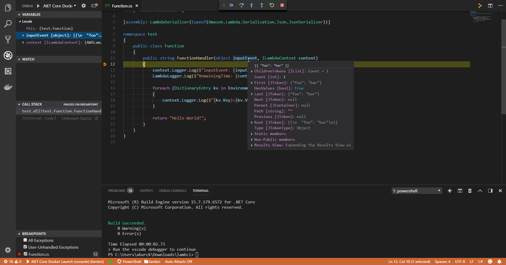

# Info

This project was built to test dotnet core 2.0/2.1 debugging within the lambda dotnet runtime docker container.

## Setup & Run

1. `> docker pull lambci/lambda:build-dotnetcore2.1`
1. `> docker pull lambci/lambda:dotnetcore2.1`
1. `> .\run.ps1` on windows or `> chmod +x run.sh && ./run.sh` on linux/mac
1. Set a breakpoint in Function.cs
1. Run the vscode _.NET Core Docker Launch (console)_ launch task (F5)
1. Profit!

## Description

This project utilized the container images from the [lambci/docker-lambda](https://github.com/lambci/docker-lambda/tree/master/examples/dotnetcore2.1) project as well as the sample code and vscode launch configuration from the [sleemer/docker.dotnet.debug](https://github.com/sleemer/docker.dotnet.debug) project.

The __lambci/lambda:dotnetcore2.1__ container image was modified to include VSDBG, the dotnet core debugger. Furthermore, the entrypoint was changed to wait for a debugger to attach to the container.

The vscode launch configuration was modified to use the `pipeTransport` protocol to communicate with VSDBG in the docker container and run the lambda bootstrapper, __MockBootstraps.dll__.

## Screenshots

